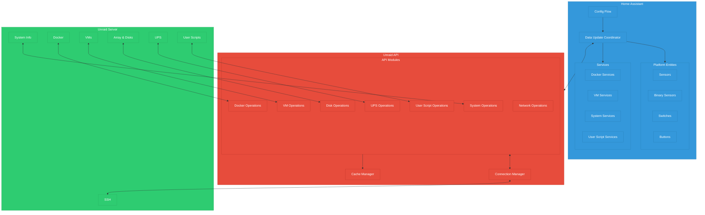

```mermaid
flowchart TD
    subgraph HomeAssistant["Home Assistant"]
        ConfigFlow["Config Flow"]
        UpdateCoordinator["Data Update Coordinator"]
        
        subgraph Platforms["Platform Entities"]
            Sensors["Sensors"]
            BinarySensors["Binary Sensors"]
            Switches["Switches"]
            Buttons["Buttons"]
        end
        
        subgraph Services["Services"]
            DockerServices["Docker Services"]
            VMServices["VM Services"]
            SystemServices["System Services"]
            UserScriptServices["User Script Services"]
        end
    end
    
    subgraph UnraidAPI["Unraid API"]
        ConnectionManager["Connection Manager"]
        CacheManager["Cache Manager"]
        
        subgraph Modules["API Modules"]
            SystemOps["System Operations"]
            DiskOps["Disk Operations"]
            DockerOps["Docker Operations"]
            VMOps["VM Operations"]
            UPSOps["UPS Operations"]
            UserScriptOps["User Script Operations"]
            NetworkOps["Network Operations"]
        end
    end
    
    subgraph Unraid["Unraid Server"]
        SSH["SSH"]
        System["System Info"]
        Docker["Docker"]
        VMs["VMs"]
        Array["Array & Disks"]
        UPS["UPS"]
        Scripts["User Scripts"]
    end
    
    ConfigFlow --> UpdateCoordinator
    UpdateCoordinator --> Platforms
    UpdateCoordinator --> Services
    
    UpdateCoordinator <--> UnraidAPI
    
    ConnectionManager <--> SSH
    
    Modules <--> ConnectionManager
    Modules --> CacheManager
    
    System <--> SystemOps
    Docker <--> DockerOps
    VMs <--> VMOps
    Array <--> DiskOps
    UPS <--> UPSOps
    Scripts <--> UserScriptOps
    
    classDef haNode fill:#3498db,stroke:#2980b9,color:white
    classDef apiNode fill:#e74c3c,stroke:#c0392b,color:white
    classDef unraidNode fill:#2ecc71,stroke:#27ae60,color:white
    
    class HomeAssistant,ConfigFlow,UpdateCoordinator,Platforms,Services,Sensors,BinarySensors,Switches,Buttons,DockerServices,VMServices,SystemServices,UserScriptServices haNode
    class UnraidAPI,ConnectionManager,CacheManager,Modules,SystemOps,DiskOps,DockerOps,VMOps,UPSOps,UserScriptOps,NetworkOps apiNode
    class Unraid,SSH,System,Docker,VMs,Array,UPS,Scripts unraidNode
``` 