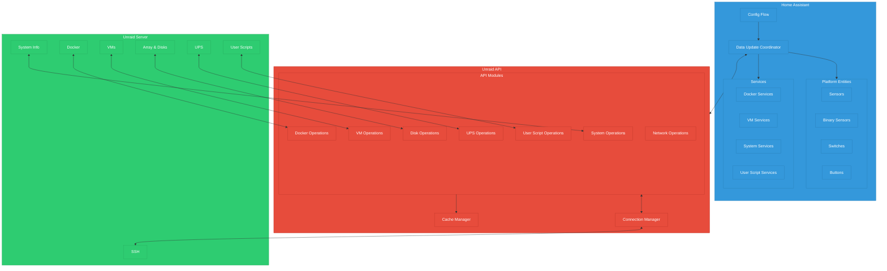
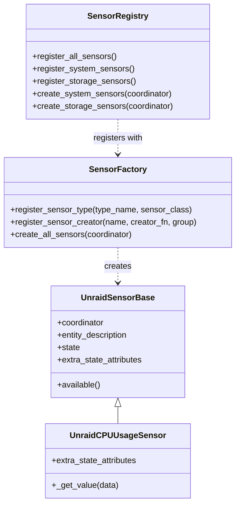
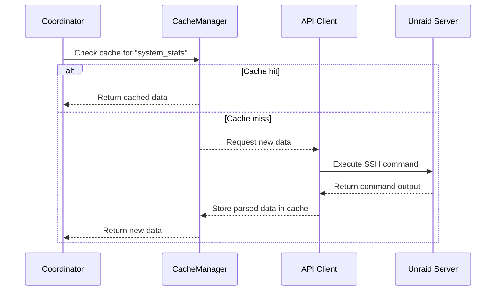
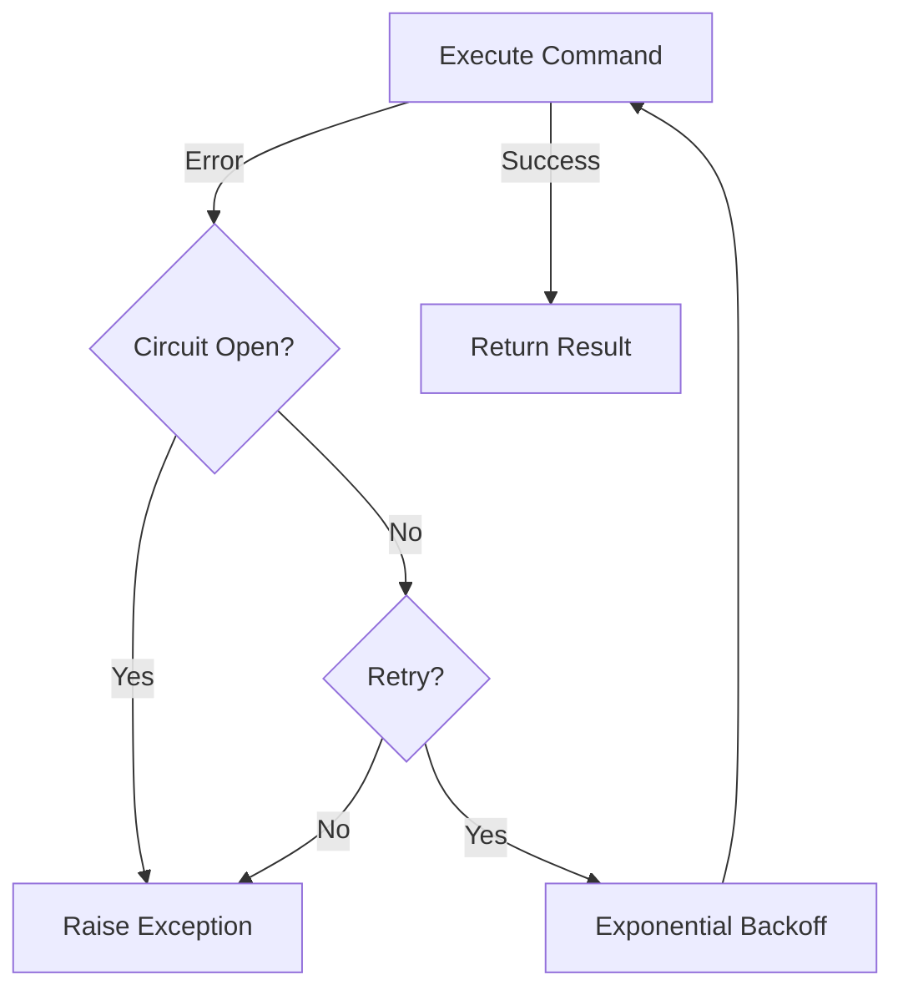

# Architecture Overview

This document provides a detailed overview of the Unraid integration's architecture, explaining how the various components work together.

## High-Level Architecture

The Unraid integration follows a layered architecture pattern:

## Key Components

### Home Assistant Integration Layer

This is the top layer that integrates with Home Assistant's framework:

1. **Config Flow** (`config_flow.py`): 
   - Handles setup and configuration of the integration
   - Validates connection settings
   - Manages integration options

2. **Data Update Coordinator** (`coordinator.py`):
   - Central component managing all data updates
   - Implements intelligent update scheduling
   - Provides data to all entities
   - Manages caching and state preservation

3. **Entity Platforms**:
   - **Sensors** (`sensor.py`, `sensors/`): Read-only data points
   - **Binary Sensors** (`binary_sensor.py`, `diagnostics/`): Boolean state sensors
   - **Switches** (`switch.py`): Toggleable controls
   - **Buttons** (`button.py`): Action triggers

4. **Services** (`services.py`):
   - Provides Home Assistant services for performing actions
   - Handles command execution and parameter validation

### API Layer

The middle layer that handles communication with the Unraid server:

1. **API Client** (`unraid.py`):
   - Main client class combining functionality from mixins
   - Provides consistent interface for all operations

2. **Connection Manager** (`api/connection_manager.py`):
   - Manages SSH connections with connection pooling
   - Implements circuit breaking and retry logic
   - Provides fault tolerance and health monitoring

3. **Cache Manager** (`api/cache_manager.py`):
   - Optimizes performance by caching data
   - Implements TTL-based cache invalidation
   - Prioritizes data based on importance

4. **API Modules**:
   - **System Operations** (`api/system_operations.py`): System information
   - **Disk Operations** (`api/disk_operations.py`): Array and disk management
   - **Docker Operations** (`api/docker_operations.py`): Container control
   - **VM Operations** (`api/vm_operations.py`): Virtual machine management
   - **UPS Operations** (`api/ups_operations.py`): UPS monitoring
   - **User Script Operations** (`api/userscript_operations.py`): User script execution
   - **Network Operations** (`api/network_operations.py`): Network statistics

### Unraid Layer

The actual Unraid server that the integration communicates with:

1. **SSH Connection**:
   - Primary communication channel
   - Used for executing commands and retrieving data

2. **Unraid Components**:
   - **System**: OS and hardware information
   - **Docker**: Container management system
   - **VMs**: Virtual machines
   - **Array & Disks**: Storage system
   - **UPS**: Uninterruptible power supply
   - **User Scripts**: Custom scripts defined in Unraid

## Data Flow

1. **Configuration and Initialization**:
   - User configures the integration through the UI
   - Home Assistant creates a ConfigEntry
   - Integration sets up the coordinator and API client
   - Platforms register entities with Home Assistant

2. **Data Update Cycle**:
   - Coordinator schedules regular updates
   - API client requests data from the Unraid server
   - Data is processed, normalized, and cached
   - Entities receive updated data through the coordinator

3. **User Actions**:
   - User interacts with an entity (e.g., switch, button)
   - Entity calls appropriate API method
   - API executes command on the Unraid server
   - Coordinator refreshes data to reflect changes

## Factory Pattern for Entity Creation

The integration uses a factory pattern for creating entities:

This pattern allows for flexible entity creation:
- Sensor types are registered once
- Creator functions determine what entities to create
- Factory orchestrates the creation process

## Caching and Performance Optimization

The integration implements sophisticated caching to minimize SSH connections:

Key aspects of the caching system:
- Different TTLs for different data types
- Memory-efficient storage with size limits
- Priority-based invalidation
- Performance monitoring

## Error Handling and Recovery

The integration includes robust error handling:

Key error handling features:
- Exception hierarchy for different error types
- Automatic retries with exponential backoff
- Circuit breaking to prevent cascading failures
- Detailed logging for troubleshooting 